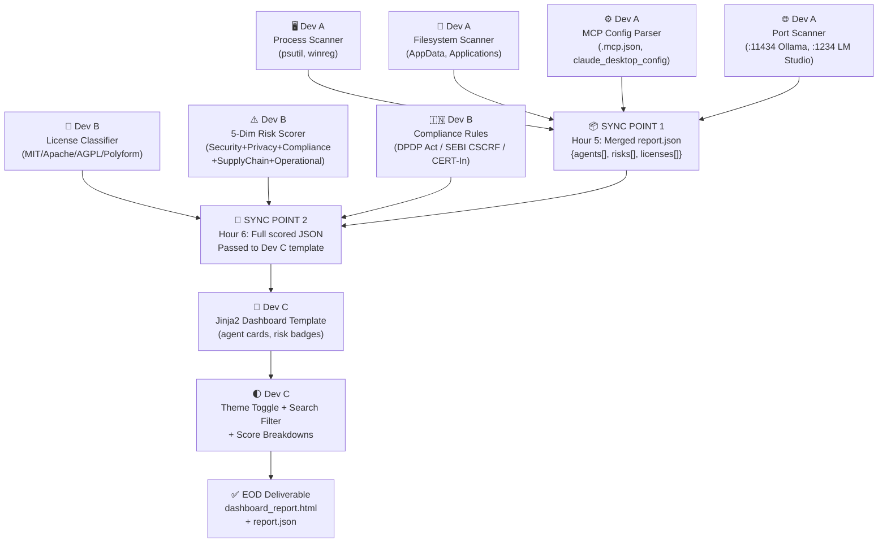

# 1-Day Team Sprint: AI Agent Discovery & Governance Module

This document is an improved, research-grounded implementation plan for a **3-member development team** working **6–8 hours daily** (18–24 total person-hours). It is directly aligned with the technical findings from [research1.html](file:///d:/College%20Work/Internship/Group%20A-Y-S/System%20Scanner/New%20Features%20Research/research1.html) and the license compliance deep-dive in [research2.html](file:///d:/College%20Work/Internship/Group%20A-Y-S/System%20Scanner/New%20Features%20Research/research2.html).

The objective is to implement a fully functional **AI Agent Discovery & Governance module** that:
1. Scans endpoint systems for AI agents across 11 researched agent profiles.
2. Evaluates detected agents for license risk using GNU/permissive license logic.
3. Computes a 5-dimension composite risk score (0–100).
4. Outputs a styled, interactive HTML governance dashboard.

---

## 👥 Team Roles & Responsibilities

| Role | Owner Focus | Exact File Deliverable | Research Reference |
| :--- | :--- | :--- | :--- |
| **Developer A — Discovery Engine** | Multi-layer endpoint telemetry: processes, file paths, ports, registry, MCP configs | `agent_discovery.py`, `mcp_parser.py` | Research 1: Phases 1 & 2 |
| **Developer B — Governance Engine** | License classification (11 agents × 7 license types), 5-dimension risk scorer, DPDP/SEBI/CERT-In compliance rules | `license_classifier.py`, `risk_scorer.py`, `test_governance.py` | Research 1: Phases 3 & 4, Research 2: Full |
| **Developer C — Dashboard & Reporting** | Glassmorphic HTML dashboard, Jinja2 template bindings, reading progress bar, interactive risk filters, dark/light mode | `dashboard.html.j2`, `styles.css`, `dashboard_logic.js` | Research 1: Phase 5 agent card UI patterns |

---

## 🎯 Scope: 11 Target AI Agents (from Research)

The sprint must detect and profile all 11 agents documented in the research:

| # | Agent | Ecosystem | Expected Risk Score | Recommendation |
|:--|:------|:----------|:--------------------|:---------------|
| 1 | Microsoft Copilot (Consumer) | Microsoft | 65 — Very High | Block |
| 2 | Microsoft 365 Copilot | Microsoft | 25 — Moderate | Approved + Monitor |
| 3 | GitHub Copilot | Microsoft | 30 — Moderate | Approved + Monitor |
| 4 | Google Gemini (Web/Workspace) | Google | 45 — High | Audit & Block Consumer |
| 5 | Google Gemini CLI | Google | 68 — Very High | Block (unless Vertex AI) |
| 6 | OpenAI ChatGPT Desktop | OpenAI | 35 — Moderate | Approved + Monitor |
| 7 | OpenAI Codex CLI | OpenAI | 60 — High | Restrict from CI/CD |
| 8 | OpenAI Agents SDK | OpenAI | 25 — Moderate | Approved Internal |
| 9 | CrewAI | Open Source | 35 — Moderate | Approved + Monitor |
| 10 | Open Interpreter | Open Source | 85 — **Critical** | Block Immediately |
| 11 | AutoGPT | Open Source | 95 — **Critical** | Block Immediately |

---

## 🗺️ Sprint Architecture & Collaboration Flow



---

## ⏱️ Hourly Execution Plan

---

### 🌅 Hours 1–2 | Foundation — Environment, Mock Schema, Initial Scanners

> **Goal:** All three developers have runnable code by end of Hour 2. Developer C works from a pinned mock JSON, completely decoupled from backend.

---

#### 🔵 Developer A — Process & Binary Detection

**Targets from Research Phase 1:**

- [ ] Set up Python project: `venv`, `requirements.txt` (`psutil`, `winreg` on Windows, `jinja2`).
- [ ] Implement `process_scanner()` using `psutil.process_iter()` scanning for:
  - `ChatGPTHelper.exe` → OpenAI ChatGPT Desktop
  - `Claude.exe` → Anthropic Claude Desktop
  - `ollama.exe` or `ollama` daemon → Ollama LLM runtime
  - `copilot-agent` → GitHub Copilot (IDE extension process)
  - `gemini`, `gemini-cli.cmd` → Gemini CLI
  - `codex.exe` → OpenAI Codex CLI
- [ ] Implement `path_scanner()` checking hardcoded research paths:
  - Windows: `C:\Users\<user>\AppData\Local\Programs\ChatGPT\resources\app.asar.unpacked\`
  - Windows: `C:\Users\<user>\AppData\Local\Microsoft\WindowsApps\Claude.exe`
  - Windows: `C:\Users\<user>\AppData\Roaming\npm\gemini.cmd`
  - macOS: `/Applications/ChatGPT.app`, `/Applications/Claude.app`
  - Global: `~/.local/bin/gemini`

---

#### 🟢 Developer B — License Pattern Database + Test Harness

**Targets from Research Phase 3 & Research 2:**

- [ ] Define the license taxonomy dictionary (all 7 types from research):

```python
LICENSE_TAXONOMY = {
    "MIT":       {"copyleft": False, "commercial": True,  "saas_ok": True,  "risk_level": "low"},
    "Apache-2.0":{"copyleft": False, "commercial": True,  "saas_ok": True,  "risk_level": "low"},
    "LGPL":      {"copyleft": "weak","commercial": True,  "saas_ok": True,  "risk_level": "moderate"},
    "GPL":       {"copyleft": True,  "commercial": False, "saas_ok": True,  "risk_level": "high"},
    "AGPL":      {"copyleft": True,  "commercial": False, "saas_ok": False, "risk_level": "critical"},
    "Polyform":  {"copyleft": False, "commercial": False, "saas_ok": False, "risk_level": "high"},
    "Proprietary":{"copyleft": False,"commercial": "conditional", "saas_ok": True, "risk_level": "moderate"},
}
```

- [ ] Map each of the 11 research agents to their known license type.
- [ ] Write `tests/test_governance.py` with baseline assertions (AGPL → `saas_ok = False`, Polyform → `commercial = False`).
- [ ] Set up DPDP/SEBI/CERT-In compliance flag rules:
  - If agent transmits data externally on consumer tier → `dpdp_risk = True`
  - If agent lacks audit log support → `cert_in_6hr_risk = True`
  - If no SOC visibility into agent → `sebi_cscrf_risk = True`

---

#### 🟡 Developer C — Mock JSON Schema + Dashboard Scaffold

- [ ] Define and commit the **pinned mock `mock_report.json`** schema (agreed with Dev A/B):

```json
{
  "scan_timestamp": "2026-06-18T10:00:00",
  "hostname": "DESKTOP-01",
  "os": "Windows 11",
  "agents": [
    {
      "name": "Google Gemini CLI",
      "vendor": "Google",
      "ecosystem": "Google",
      "platform": "Node.js CLI",
      "install_path": "C:\\Users\\user\\AppData\\Roaming\\npm\\gemini.cmd",
      "running": true,
      "authorized": "review",
      "license": "Apache-2.0",
      "scores": {
        "security": 75, "compliance": 80,
        "data_privacy": 85, "operational": 40
      },
      "total_risk": 68,
      "risk_tier": "very_high",
      "recommendation": "Block unless bound to Vertex AI Enterprise"
    }
  ]
}
```

- [ ] Build the HTML scaffold: sidebar nav, main content area, agent card grid.
- [ ] Apply CSS variables for light/dark glass themes (`--card-bg`, `--primary`, `--crit-risk-bg` etc.).

---

### ☀️ Hours 3–4 | Expansion — MCP Parser, Risk Scorer, Interactive UI

---

#### 🔵 Developer A — MCP Configuration Scanner + Port Detection

**Targets from Research Phase 1 (MCP section):**

- [ ] Implement `mcp_config_scanner()` searching these exact paths from research:
  - `~/.deepagents/.mcp.json` (deep learning frameworks)
  - `~/.copilot/mcp-config.json` (GitHub CLI integrations)
  - `%APPDATA%\Claude\claude_desktop_config.json` (Anthropic Claude Desktop)
  - Any `.mcp.json` files in project directories (recursive scan)
- [ ] Parse JSON content: extract `mcpServers`, tool names, endpoint URLs, any external server references.
- [ ] Flag **MCP Poisoning Risk** if any server URL is not a known localhost or approved vendor endpoint.
- [ ] Implement `port_scanner()` checking research-specified ports:
  - `11434` → Ollama daemon active
  - `1234` → LM Studio active
  - `8000`, `5000`, `8080` → Generic inference server
- [ ] Implement Windows Registry scanner using `winreg`:
  - `HKEY_LOCAL_MACHINE\SOFTWARE\Policies\Microsoft\Windows\WindowsCopilot\TurnOffWindowsCopilot`
  - Check presence of `MICROSOFT.COPILOT` package via `winreg` or `appx` query.

---

#### 🟢 Developer B — 5-Dimension Risk Scorer (Full Implementation)

**Targets from Research Phase 4:**

- [ ] Implement `calculate_risk(agent_profile) -> RiskResult` with 5 weighted dimensions:

| Dimension | Key Questions from Research | Max Score |
|:----------|:---------------------------|:----------|
| **Security** | Autonomous shell execution? Read/write FS? MCP tool calls? Prompt injection surface? | 25 |
| **Data Privacy** | Transmits to external endpoints? Cloud inference? Vendor retains prompts? Telemetry? | 25 |
| **Compliance** | DPDP Act breach risk? CERT-In 6-hr reporting blocked? SEBI CSCRF SOC visibility? | 25 |
| **Supply Chain** | Unknown maintainer? Unverified cryptographic signatures? Known CVEs in dependencies? | 15 |
| **Operational** | Infinite reasoning loops? Rapid breaking API changes? Vendor lock-in? | 10 |

- [ ] Hard-code the research-verified baseline scores for all 11 agents as unit test fixtures.
- [ ] Add **Copyleft Contamination** flag from Research 2:
  - AGPL detected → append `copyleft_contamination_risk: "critical"` to governance report.
  - GPL in SaaS → append `copyleft_contamination_risk: "high"` (SaaS loophole applies).
  - AI-generated code review flag → if agent is a code assistant, add `output_copyright_risk: true`.
- [ ] Implement `vendor_verification()`: compare installed binary hash/version against known-good baseline dictionary.

---

#### 🟡 Developer C — Interactive UI Features

- [ ] Implement reading progress bar (fixed top gradient strip, scroll-driven width update).
- [ ] Implement sidebar active section tracker (IntersectionObserver or scroll event).
- [ ] Implement search input + 3-tab filter system (`All` / `Approved & Moderate` / `Review & Banned`).
- [ ] Build expandable risk dimension breakdown UI per agent card.
- [ ] Build 4 summary metric boxes: `Models Found`, `Frameworks`, `Agents`, `Avg Risk Score`.

---

### 🔗 Hours 5–6 | Integration Sync — Schema Binding & Template Wiring

> **Critical path: Both sync points happen in this block. All 3 developers collaborate.**

---

#### ⚡ Sync Point 1 — Hour 5: Merge Telemetry + Governance JSON

- [ ] **Dev A hands off** `agent_discovery.py` output (raw agent dict list) to **Dev B**.
- [ ] **Dev B** runs the risk scorer + license classifier over each discovered agent, producing the final enriched `report.json`.
- [ ] **Verify schema contract** matches `mock_report.json` agreed in Hour 1 (Dev C can then drop the mock and use the real file).
- [ ] Test with at least **3 real agents** installed on the dev machine (e.g., Gemini CLI via npm, Ollama via daemon, GitHub Copilot extension).
- [ ] Edge case check: agent found by path but process not running → `running: false`, still scored.

---

#### ⚡ Sync Point 2 — Hour 6: Template Binding & Live Dashboard

- [ ] **Dev C** replaces `mock_report.json` references in the Jinja2 template with real variable bindings from `report.json`.
- [ ] Wire each agent profile card: `{{ agent.name }}`, `{{ agent.total_risk }}`, `{{ agent.risk_tier }}`, `{{ agent.recommendation }}`.
- [ ] Wire each risk dimension score bar: `{{ agent.scores.security }}` etc.
- [ ] Wire copyleft contamination badge from Research 2: if `copyleft_contamination_risk = "critical"` → render `⚠️ AGPL Contamination Risk` warning label on agent card.
- [ ] Render executive synthesis callout panels per ecosystem (Microsoft / Google / OpenAI / Open Source).
- [ ] Verify the Jinja2 template renders cleanly from Python: `python main.py --scan --format html`.

---

### 🌇 Hours 7–8 | Verification, QA & Polish

---

#### 🔵 Developer A — Cross-Platform Validation

- [ ] Test scanner on **Windows** paths (registry, AppData, npm global).
- [ ] Verify **MCP Poisoning** detection: drop a dummy `.mcp.json` pointing to `http://external-evil-server.com` → confirm flag raised.
- [ ] Verify Ollama port `11434` detection: if daemon is running, confirm it appears in report.
- [ ] Verify `copilot-agent` JSON-RPC process is detected when VS Code is open with GitHub Copilot.
- [ ] Confirm graceful failure on permission-denied paths (no crash, logged as `{"scan_error": "permission_denied"}`).

---

#### 🟢 Developer B — Scoring Accuracy Verification

- [ ] Run all 11 agents through the risk scorer against expected research scores:

| Agent | Expected Score | Tolerance |
|:------|:--------------|:---------|
| Microsoft Copilot (Consumer) | 65 | ±5 |
| Microsoft 365 Copilot | 25 | ±5 |
| GitHub Copilot | 30 | ±5 |
| Google Gemini CLI | 68 | ±5 |
| OpenAI Codex CLI | 60 | ±5 |
| Open Interpreter | 85 | ±5 |
| AutoGPT | 95 | ±3 |

- [ ] Verify **Research 2 copyleft rules**:
  - Confirm AGPL agent → `saas_ok: false`, `copyleft_contamination_risk: "critical"`.
  - Confirm GPL agent without SaaS deployment → `risk_level: "high"` but not `critical`.
  - Confirm MIT/Apache-2.0 → no copyleft flags raised.
- [ ] Run `python -m pytest tests/test_governance.py -v` — all tests must pass.

---

#### 🟡 Developer C — UI/UX Final Polish

- [ ] Test dashboard rendering with all 11 agents loaded → ensure no card overflow or layout breaks.
- [ ] Verify dark/light mode persists correctly on page reload (localStorage check).
- [ ] Verify search filters show/hide cards correctly: search `"google"` shows only Gemini profiles.
- [ ] Verify risk tier colour coding matches research:
  - Score 0–20: `--low-risk` (green)
  - Score 21–40: `--mod-risk` (amber)
  - Score 41–60: `--high-risk` (orange)
  - Score 61–80: `--high-risk` (orange-red, label "Very High")
  - Score 81–100: `--crit-risk` (red, label "Critical")
- [ ] Add **AGPL/GPL contamination warning banner** (Research 2 integration) — appears at top of dashboard if any critical copyleft agent is detected.

---

## 📦 End-of-Day Deliverables

| # | Deliverable | Owner | Description |
|:--|:-----------|:------|:------------|
| 1 | `agent_discovery.py` | Dev A | Parallel scanner: processes, paths, MCP configs, ports, registry |
| 2 | `mcp_parser.py` | Dev A | MCP config JSON parser with poisoning detection |
| 3 | `license_classifier.py` | Dev B | Maps agents → license type → copyleft rules |
| 4 | `risk_scorer.py` | Dev B | 5-dimension risk calculator (0–100) with DPDP/SEBI/CERT-In flags |
| 5 | `report.json` | Dev A + B | Fully enriched JSON with scores for all discovered agents |
| 6 | `dashboard.html.j2` | Dev C | Interactive Jinja2 dashboard template |
| 7 | `styles.css` | Dev C | Light/dark glassmorphic CSS with risk tier colour tokens |
| 8 | `dashboard_logic.js` | Dev C | Search, filter, theme toggle, score breakdown logic |
| 9 | `tests/test_governance.py` | Dev B | 11+ unit tests against expected research scores and license rules |

---

## 🚨 Sprint Risks & Mitigations

> [!WARNING]
> **Risk: OS Permission Failures on Endpoint Paths**
> Paths like `%APPDATA%\Claude\claude_desktop_config.json` or Windows Registry keys may throw `PermissionError` or `FileNotFoundError`.
> **Mitigation:** Wrap every read in `try/except (PermissionError, FileNotFoundError, OSError)` and emit `{"status": "scan_error", "reason": "permission_denied"}` in the agent record. Never raise; always log and continue.

> [!IMPORTANT]
> **Risk: Schema Contract Drift Between Developers**
> Dev A changes a field name mid-sprint → Dev C's template breaks → Dev B's scoring fails.
> **Mitigation:** Freeze `mock_report.json` in Hour 1. Any schema changes require a **30-second Slack/chat message** to all three developers before committing.

> [!CAUTION]
> **Risk: AGPL Copyleft Rules Misclassified**
> Incorrectly classifying AGPL as GPL (or vice versa) would report a false "SaaS safe" result — a real compliance risk under Indian DPDP regulations.
> **Mitigation:** Dev B's test suite must include dedicated AGPL vs GPL vs LGPL distinction tests. These tests run first before any integration, validating against Research 2's exact definitions.

> [!NOTE]
> **Risk: AutoGPT / Open Interpreter Not Installed on Dev Machine**
> These Critical-risk agents may not be running on the test machine, making it hard to test their detection paths.
> **Mitigation:** Dev A should create a `fixtures/` folder with sample MCP config files, Pip manifest snapshots, and `docker-compose.yml` stubs mimicking AutoGPT's disk footprint. Test detection logic against fixtures, not live installs.

---

## 📋 Quick-Reference Checklist

```
HOUR 1–2: Foundation
 [ ] Dev A: Process scanner running (finds ChatGPTHelper.exe, ollama)
 [ ] Dev B: License taxonomy dict defined, 3+ unit tests passing
 [ ] Dev C: mock_report.json locked, HTML scaffold with CSS variables ready

HOUR 3–4: Expansion
 [ ] Dev A: MCP config parser + port scanner operational
 [ ] Dev A: Windows registry scanner for Copilot policy keys
 [ ] Dev B: 5-dimension risk calculator returns score for 1 agent end-to-end
 [ ] Dev B: Copyleft contamination flags wired for AGPL/GPL
 [ ] Dev C: Search + filter + dark mode working on mock data

HOUR 5: Sync Point 1 (All 3 Developers)
 [ ] report.json schema matches mock_report.json
 [ ] 3+ real agents detected and fully scored
 [ ] Dev C switches from mock JSON to real report.json

HOUR 6: Sync Point 2 (All 3 Developers)
 [ ] Jinja2 template renders all 11 agent cards
 [ ] AGPL contamination badge appears on relevant agents
 [ ] Dashboard opens cleanly in browser from python main.py --scan --format html

HOUR 7–8: QA & Polish
 [ ] Dev A: Permission-denied graceful handling verified
 [ ] Dev B: pytest -v → all tests green
 [ ] Dev C: Dark mode + all 11 agents rendered with correct risk tier colours
 [ ] Final EOD commit pushed to Git with tag v0.1.0-governance-poc
```
