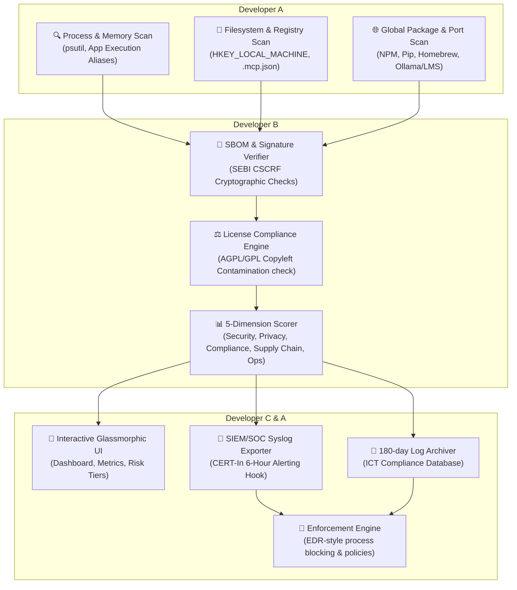

# 2-Week Team Sprint: Enterprise AI Agent Discovery & Governance Module

This document details an optimized, production-grade **2-week (10 working days) implementation plan** for a **3-member development team** to build, test, and deploy the **Enterprise AI Agent Discovery and Governance Module**. 

It consolidates the 12-week enterprise vision of [phases.txt](file:///d:/College%20Work/Internship/Group%20A-Y-S/System%20Scanner/New%20Features%20Research/phases.txt) with the agile, role-based structure of [implementation_plan_3member_1day.md](file:///d:/College%20Work/Internship/Group%20A-Y-S/System%20Scanner/New%20Features%20Research/implementation_plan_3member_1day.md), utilizing the existing codebase scaffold as a foundation.

---

## 👥 Team Roles & Core Responsibilities

| Role | Responsibility Area | Core Deliverables | Relevant Compliance Frameworks |
| :--- | :--- | :--- | :--- |
| **Developer A** *Telemetry & Systems* | Multi-layered endpoint telemetry (process memory, filesystems, registry keys, ports), MCP configs, package managers, and EDR-like local blocking mechanisms. | `agent_discovery.py`, `mcp_parser.py`, `enforcement_engine.py` | CERT-In Telemetry Logging |
| **Developer B** *Security & Compliance* | Software signature verification, SBOM generation, license compliance analyzer, 5-dimension risk scorer, and India-specific compliance checks. | `signature_verifier.py`, `sbom_generator.py`, `license_compliance.py`, `risk_scorer.py` | SEBI CSCRF (SBOM & Signatures), India DPDP Act |
| **Developer C** *Reporting & Integration* | Responsive, glassmorphic HTML reporting dashboard, SIEM/SOC JSON exporters, 180-day log database backend, and test/build automation. | `dashboard_logic.js`, `exporter.py`, `log_retention.py`, `tests/` suite | CERT-In 6-Hour reporting, 180-day ICT Log Retention |

---

## 🏗️ System Architecture & Workflow

---

## 📅 Sprint 1: Telemetry, SBOM, and Risk Scoring (Days 1–5)

### 🎯 Sprint Goal
Establish a comprehensive endpoint discovery engine that scans registry keys, ports, Model Context Protocol (MCP) configs, global package manager manifests, validates application signatures, and computes 5-dimension risk scores.

---

### 📆 Day 1: Multi-Layered Telemetry & Core Scanners
* **Developer A — Active Telemetry & Registry Scan**
  * Integrate active process memory scanning to flag background running AI daemons (e.g., `ChatGPTHelper.exe`, `Claude.exe`).
  * Implement registry-level checking on Windows for Microsoft Copilot configurations (`MICROSOFT.COPILOT` AppX package and `HKEY_LOCAL_MACHINE\...\WindowsCopilot\TurnOffWindowsCopilot` key).
  * Exclude large operating system directories during scans to maintain system responsiveness.
* **Developer B — Cryptographic Signature & Hash Verification**
  * Build the cryptographic package verifier to check signatures of critical executables.
  * Research and hardcode baseline secure SHA-256 hashes for approved enterprise clients (Google Workspace, Microsoft 365 Copilot, GitHub Copilot).
* **Developer C — Dashboard Foundations & Layout**
  * Design a responsive CSS grid layout using modern typography and high-contrast glassmorphic design variables (`--card-bg`, `--primary`, etc.).
  * Build UI placeholders for the 5-dimension risk indicators and executive summary panels.

---

### 📆 Day 2: Package Managers & MCP Configuration Scanner
* **Developer A — Global Package Scanners & MCP Parser**
  * Implement scans for global package managers (NPM prefixes like `AppData/Roaming/npm`, Python `pip` environments, macOS `Homebrew` prefixes) to find developer-focused CLI agents.
  * Build a parser to index and analyze Model Context Protocol configuration files (`.mcp.json`, `mcp-config.json`, and Anthropic's Claude Desktop config).
* **Developer B — Software Bill of Materials (SBOM) Generation**
  * Design an SBOM generation system compliant with SEBI CSCRF guidelines, exporting standard SPDX or CycloneDX JSON schemas of all active software dependencies.
  * Create a baseline directory to cross-reference package hashes and flag unverified packages.
* **Developer C — Metrics Dashboard & Theme Engine**
  * Wire Jinja2 templates to accept the unified JSON report payload.
  * Build a dark/light mode toggle with persistent state (saved to browser `localStorage`).
  * Create the scanning progress animation and visual telemetry indicators.

---

### 📆 Day 3: Network Listening Ports & License Database
* **Developer A — Network Port Monitor**
  * Implement a fast port scanner targeting active local LLM inference engines (Port `11434` for Ollama, `1234` for LM Studio, and ports `8000`/`8080`/`5000` for generic servers).
  * Map local active connections back to their parent process IDs (PIDs) using `psutil`.
* **Developer B — License Taxonomy Database & Code Scan**
  * Codify the license taxonomy database mapping the 7 target licenses (MIT, Apache 2.0, LGPL, GPL, AGPL, Polyform Shield, Proprietary).
  * Build an AST parser to monitor local developer workspaces, flagging instances where restrictive GNU-family licenses (like AGPL v3) are imported or used.
* **Developer C — Interactive UI Filters & Cards**
  * Implement client-side JavaScript search bar filtering.
  * Design interactive filter tabs on the dashboard (`All` / `Approved & Moderate` / `Review & Banned`).
  * Add a progress bar indicating dashboard generation status.

---

### 📆 Day 4: Risk Scorer Engine Implementation
* **Developer A — Integration of Sub-modules**
  * Integrate the telemetry modules (Registry, Port, Package, MCP, Process) into the scanner controller.
  * Optimize execution using `ThreadPoolExecutor` and ensure all filesystem scans are protected against permissions/access errors.
* **Developer B — 5-Dimension Risk Scoring Logic**
  * Implement the mathematical model to compute composite risk scores (0–100) across 5 dimensions:
    1. **Security (25%)**: Shell execution capabilities, filesystem modifications, MCP tool usage.
    2. **Data Privacy (25%)**: Data transmission destinations, cloud inference models, model training settings.
    3. **Compliance (25%)**: DPDP Act compliance, local log availability, SOC visibility.
    4. **Supply Chain (15%)**: Unverified signatures, open-source dependencies, CVE baselines.
    5. **Operational (10%)**: Infinite reasoning loops, dependency maintenance, lock-in risk.
* **Developer C — Risk Dimension Breakdowns & Charts**
  * Implement visually appealing HTML/CSS components (like progress bars or charts) representing the score for each of the 5 dimensions on each agent card.
  * Integrate custom alert badges for critical risks (e.g., AGPL license, MCP poisoning risk, or unverified packages).

---

### 📆 Day 5: Sprint 1 Integration & Demo
* **Entire Team — Testing, Merging & Alignment**
  * Merge Sprint 1 code branches into the main integration repository.
  * Validate output data: Run the combined scanner on a local system, producing a complete `report.json` and a rendered `dashboard.html`.
  * Verify that all 11 target AI agents (from Microsoft Copilot to Open Interpreter) are correctly classified according to their expected risk profiles.
  * Complete core unit tests and present a working demo of the detection and risk engine.

---

## 📅 Sprint 2: Enforcement, Compliance, SOC & Hardening (Days 6–10)

### 🎯 Sprint Goal
Implement active endpoint enforcement policies, construct the compliance reporting exporters, configure SOC/SIEM integration pipelines, verify legal log retention rules, and deploy a compiled execution bundle.

---

### 📆 Day 6: Policy Enforcement & Local Blocking
* **Developer A — Endpoint Enforcement Engine**
  * Write the process termination and blocking engine to actively suppress banned agents (e.g., `Open Interpreter`, `AutoGPT`) when they attempt to execute.
  * Develop Windows registry modifier scripts to disable consumer-grade Windows Copilot features.
* **Developer B — Regulatory Compliance Logic**
  * Integrate compliance rules targeting the Indian regulatory landscape:
    * **DPDP Act**: Flag agents transmitting user data externally without enterprise routing.
    * **SEBI CSCRF**: Check if SBOM is verified and if the agent's telemetry is logged.
    * **CERT-In**: Audit logging mechanisms to confirm incident readiness.
* **Developer C — SIEM / SOC Integration Exporter**
  * Develop a syslog / HTTP exporter module to transmit scanner telemetry JSON payloads to standard Security Operations Center (SOC) dashboards or SIEM endpoints.
  * Implement standard syslog format mapping severity levels (info, warning, err, crit) based on the computed risk tier.

---

### 📆 Day 7: MCP Poisoning Protections & Code Analysis
* **Developer A — MCP Server Verification**
  * Write an MCP configuration analyzer that validates all configured server URLs against an approved whitelist.
  * Flag unauthorized external MCP servers to mitigate configuration poisoning attempts.
* **Developer B — Developer Output Code Inspector**
  * Implement a lightweight scanner to monitor developers' local workspace outputs.
  * Scan for copyleft-licensed code snippets (GPL/AGPL) that could be inadvertently copied by AI assistants into proprietary project repositories, risking intellectual property contamination.
* **Developer C — 180-Day ICT Log Retention Database**
  * Implement a secure SQLite/local JSON database to archivate scan histories.
  * Ensure the retention mechanism complies with the CERT-In mandate requiring a strict 180-day archive of all IT security logs.
  * Build a dashboard page to visualize history trends over time.

---

### 📆 Day 8: Hardening & Cross-Platform Compliance
* **Developer A — Permission Handling & Cross-Platform Verification**
  * Test filesystem traversals across standard platforms (Windows, macOS, and Linux).
  * Gracefully handle permissions issues (`PermissionError`, `FileNotFoundError`) to ensure the agent does not crash during deep scans.
* **Developer B — Automated Verification and Unit Tests**
  * Build unit tests for the compliance engine, license database, and policy enforcement modules.
  * Target a minimum test coverage of 85% with mock inputs for processes, files, and signatures.
* **Developer C — Export Framework & Report Polish**
  * Implement PDF export capability for the HTML dashboard.
  * Add Excel/CSV exporting for the generated Software Bill of Materials (SBOM).
  * Clean up any console errors and perform UI compatibility checks across major browsers.

---

### 📆 Day 9: Optimization & Performance Tuning
* **Developer A — Performance Profiles & Memory Limits**
  * Benchmark the scanner's performance profile (CPU and RAM consumption).
  * Implement execution limit bounds to prevent scans from bottlenecking corporate hardware.
* **Developer B — Code Security Audit**
  * Run static analysis utilities (`bandit`, `pylint`) over the scanner codebase to identify potential security vulnerabilities.
  * Review all API key handlers to ensure credentials are masked at all points.
* **Developer C — UI Animations & User Feedback**
  * Add subtle, premium micro-animations (e.g., hover effects, sliding panels, fading tabs).
  * Integrate intuitive feedback UI indicators for scan state updates (e.g., "Scanning ports...", "Analyzing licenses...").

---

### 📆 Day 10: Final Deployment & Release
* **Entire Team — Compilation, Walkthrough, and Hand-off**
  * Package the Python project into compiled stand-alone executables (using `PyInstaller`) for Windows, Linux, and macOS to facilitate distribution without requiring a Python environment.
  * Update instructions in `README.md` detailing options for deploying the scanner as a local network service or as a background CLI daemon.
  * Deliver the complete validation walkthrough documenting verified test passes.

---

## 📊 End-of-Project Deliverables

| Deliverable | Owner | Format | Compliance Target |
| :--- | :--- | :--- | :--- |
| **Comprehensive Discovery Core** | Dev A | `.py` scripts & libraries | System visibility and telemetry |
| **Enforcement Engine** | Dev A | Powershell / Bash policies | Risk Mitigation / EDR integration |
| **License Compliance Evaluator** | Dev B | `.py` engine & signatures | IP Legal Security / AGPL protection |
| **5-Dimension Risk Scoring Engine** | Dev B | Risk evaluation modules | Composite threat ranking |
| **SEBI SBOM Exporter** | Dev B | JSON / CSV files | SEBI CSCRF Compliance |
| **Jinja2 Glassmorphic Dashboard** | Dev C | Responsive HTML report | Executive visibility and review |
| **180-Day ICT Log Archiver** | Dev C | SQLite database | CERT-In 180-day retention mandate |
| **SOC/SIEM Integration Hooks** | Dev C | Syslog / HTTP Exporter | CERT-In 6-hour reporting window |
| **Complete Unit & Integration Tests** | All | `pytest` suite | Software reliability |

---

## ⚠️ Key Project Risks & Mitigations

> [!WARNING]
> **Risk 1: File Access Permission Errors During Deep Scans**  
> Running deep scans across system drives frequently triggers file permission exceptions, leading to script failures.  
> * **Mitigation**: Developer A will construct a permission-safe wrapper for all filesystem walks, swallowing exceptions and logging inaccessible files in the debug log without raising errors.

> [!IMPORTANT]
> **Risk 2: EDR Blocking Policies Triggering Antivirus Flagging**  
> Writing script-based enforcement files (such as registry modifications or AppLocker triggers) may be flagged as malicious behavior by corporate antivirus software.  
> * **Mitigation**: Develop a clean CLI configuration allowing administrators to export proposed registry files or group policies rather than writing them directly to the system.

> [!CAUTION]
> **Risk 3: Performance Degradation During Parallel File Scans**  
> Dynamic filesystem searches using multiple threads can bottleneck system disk performance, slowing down developer workstations.  
> * **Mitigation**: Establish thread pool limits and utilize path pruning policies (excluding directories like `node_modules`, `.git`, `venv`, etc.) to keep scan times under 60 seconds.
