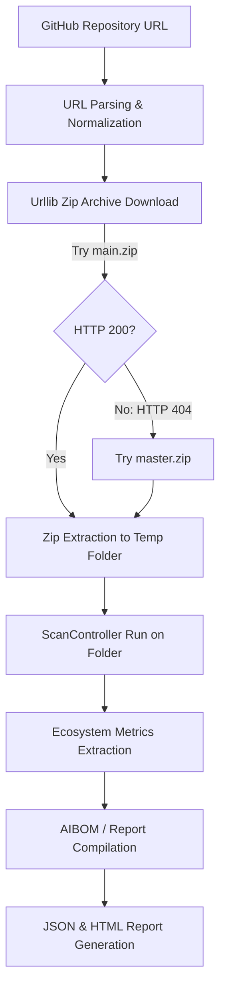

# Remote GitHub Repository Scanning — Implementation Details

This document describes the design, implementation, and features of the **Remote GitHub Repository Scanning** module integrated into the AI Discovery Scanner.

---

## 1. Operational Flow

1. **GitHub URL**: The user submits a public GitHub repository link (e.g. `https://github.com/user/repo`).
2. **URL Parsing**: Extracted into `owner` and `repo` string tokens, normalizing trailing slashes and `.git` suffixes.
3. **Download ZIP**: Uses the Python standard library `urllib.request.urlopen` with a custom browser `User-Agent` header to prevent rate limits.
   - **Branch Fallback**: Attempts to download `https://github.com/owner/repo/archive/refs/heads/main.zip` first. If the server returns a `404` or similar HTTP error, it automatically falls back to `https://github.com/owner/repo/archive/refs/heads/master.zip`.
4. **Extraction**: The ZIP archive is extracted inside a temporary subdirectory `temp_repos/` under the workspace root.
5. **Scan Controller**: Executes the core `ScanController(scan_folder=extracted_path)` recursively on the extracted folder structure.
6. **Aggregate Findings**: Translates code matches, configuration files, and package dependencies into standard finding shapes.
7. **Clean up**: Deletes downloaded files and temporal extraction folders immediately upon completing the scan to preserve local storage resources.

---

## 2. Shared Core Scan Modules Reuse

By passing the `scan_folder` parameter to the scanner engine, the remote scanning engine delegates analysis directly to the existing modular core scanners, maintaining complete system isolation:
- **`PackageScanner`**: Recursively inspects `requirements.txt` and `package.json` inside the repository, matching libraries like `openai`, `langchain`, `crewai`, `transformers`, `chromadb`, etc.
- **`AgentScanner`**: Walks script extensions (`.py`, `.js`, `.ts`, `.jsx`, `.tsx`) to inspect patterns matching agent instantiations (`AgentExecutor(`, `Crew(`, `AssistantAgent(`), vector database searches, and named LLMs.
- **`MCPScanner`**: Inspects `.cursor/mcp.json`, `mcp-config.json`, or `.kiro/settings/mcp.json` inside the repository to catalogue registered Model Context Protocol servers, transport schemas, and environments.
- **`FileScanner`, `LicenseScanner`, `ComplianceScanner`**: Walk the files to catalog risk configurations, licenses, and AI regulations compatibility.

System-level processes (`ProcessScanner`) and operating system parameters (`SystemScanner`) are executed during the run but are automatically filtered out during aggregation to avoid contaminate repo metrics with host statistics.

---

## 3. Confidence Score Rules

The engine implements deterministic score calculations following specific rules:
- **Dependency Only** (Declared in requirements or package.json): **30% Confidence**
- **Code Usage Only** (Keywords matched in source code but packages not declared): **50% Confidence**
- **Code + Configuration** (No package requirements, but imports/instances + `.env` configs exist): **75% Confidence**
- **Dependency + Code** (Ecosystem libraries declared + actual source instantiations verified): **70% Confidence**
- **Dependency + Code + Configuration** (Complete AI environment footprint matched): **95% Confidence**

---

## 4. UI Dashboard Capabilities

If `report.json` contains a `"repository"` key, the HTTP server `/report` endpoint redirects the browser client to the **Repository Telemetry Dashboard** (rendered using `repo_dashboard.html.j2`):
- **Circular Progress Score Dial**: Color-coded HSL dial showing the confidence rating (Green for 95%, Amber for 70%, Orange/Red for 30%).
- **Interactive Metric HUD**: Highlights findings counts, languages count, frameworks count, and model names count.
- **Tabbed Browsing**:
  - *Ecosystem Overview*: Breakdown of detected libraries, dialects, models, and architectures.
  - *Code Findings*: Expandable and collapsible list of exact script lines, pattern matches, and code snippets with live filtering.
  - *Confidence & Compliance*: Overview of scoring rules and DPDP Act/CERT-In auditing checkboxes.
