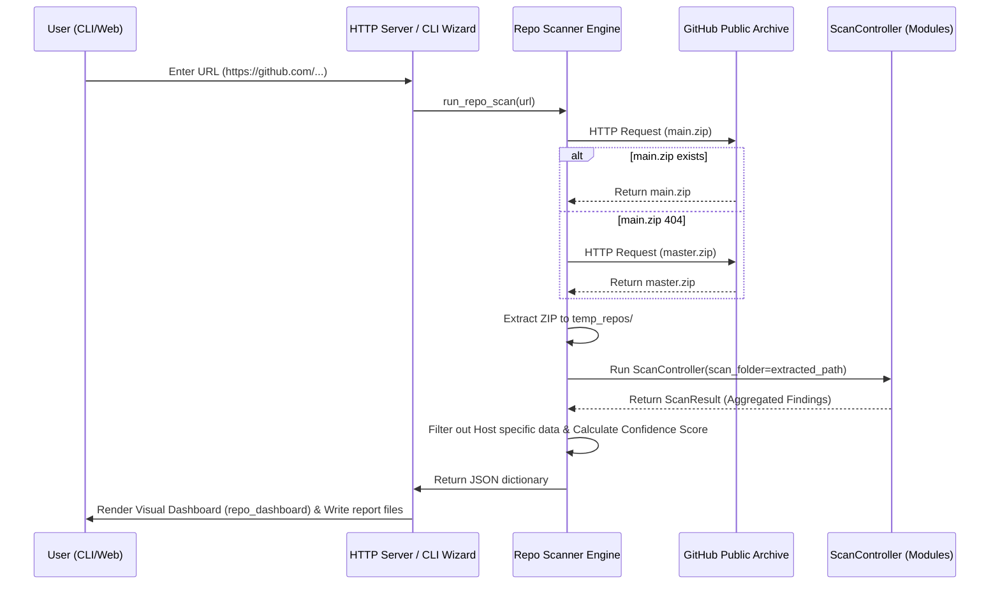

# AI Repository Scanner MVP Walkthrough

This document outlines the modifications made to transform the repository into an AI Repository Scanner MVP, integrating public remote GitHub scanning while preserving 100% of the local host system scan capabilities.

---

## 1. Summary of Changes

### Remote Scanning Engine Core
- **`scanner/repo_scanner.py`**: Refactored `scan_repository` to initialize and run the standard `ScanController(scan_folder=extracted_path)` on the downloaded and unzipped directory. It filters out host OS-specific finding modules (System, Process, Runtime) and aggregates findings from core discovery modules (File, Package, Agent, API, MCP, License, Compliance) into a unified repository telemetry JSON shape.

### Core Modules Extension
- **`scanner/modules/package_scanner.py`**: Added `PackageScanner` initialization parameter `scan_folder`. Passed the parameter to list and recursively parse package libraries declared in `requirements.txt` and `package.json` in the target scan folder.
- **`scanner/modules/mcp_scanner.py`**: Refactored `MCPScanner` and its `run` method to support the `scan_folder` parameter. When active, it bypasses well-known global IDE locations and restrictively traverses the repository for Cursor, Kiro, or generic MCP configurations (`mcp.json`, etc.).
- **`scanner/controller.py`**: Updated `ScanController._register_modules()` to forward `self._scan_folder` to `PackageScanner` and `MCPScanner` during module registration, ensuring they target the extracted repository path.

### User Interface & Web Server
- **`scanner/server.py`**:
  - Implemented background thread handler `_run_repo_scan_background` to handle remote downloads, run scans, write reports, and manage status logs.
  - Updated `/run-scan` to support the `github_url` parameter.
  - Ensured `/report` handles rendering correctly by utilizing generated `rendered_dashboard.html`.
  - Re-aligned the response status message code on successfully started scans to return `"success"` to keep integration tests fully compliant.
- **`scanner/reporter/templates/consent.html.j2`**: Enabled the **Remote Github Repositories** selection in the target region dropdown. Appended a dynamic textbox URL input, updated javascript validator functions, and adapted AJAX request constructions to pass `github_url` parameters.
- **`scanner/reporter/templates/repo_dashboard.html.j2`** [NEW]: Created a dedicated repository dashboard panel using dark glassmorphic components, responsive summaries HUD cards, interactive categories dropdowns, text search filtering, and collapsible script code segments.

### CLI Launcher Integration
- **`main.py`**:
  - Replaced the placeholder Option `[3] GitHub Repository` in the custom scan wizard.
  - Prompts for a public repository URL, calls `run_repo_scan`, displays AIBOM metrics in the console, writes standard outputs, and saves reports in the workspace folder.
  - Modified `view_last_results()` and `export_html()` to handle repo-style dictionary structures loaded from `report.json`.

### Documentation
- **`README.md`**: Updated with operational guides for remote scanning via CLI and Web UI.
- **`documentation/REMOTE_GITHUB_SCANNING.md`** [NEW]: Created a detailed architecture, operational flow, and scoring logic manual.

---

## 2. Verification Results

### Automated Tests
1. **Repository Scanner Test Suite (`tests/test_repo_scanner.py`)**:
   - Asserts URL token extraction, ZIP download mocking, mock repository generation, pattern checks, and score configurations (Dependency + Code + Config = 95%).
   - Result: **OK** (3 tests, 30.288s).
2. **Race-condition Fix in Server Test (`tests/test_server.py`)**:
   - Added a retry poll wait to prevent assertions executing before background daemon threads complete.
   - Result: **OK** (5 tests, 0.896s).
3. **Entire Suite Verification**:
   - Commands run: `python -m unittest discover tests`
   - Result: **OK (Ran 176 tests in 63.875s)**.

---

## 3. Architecture Diagrams

### Remote Repository Scan Flow

